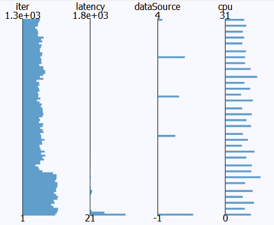

# MemAxes
MemAxes is a tool for visualizing memory access samples
acquired by load/store sampling mechanisms like Intel PEBS or AMD
IBS. It allows a user to view the data projected into various domains;
specifically, the layout of the hardware resources, the
code/variables, the dataset domain, and parallel coordinates.

----
# Quick Start
## Building
1. Set the correct `QT_DIR` and `VTK_DIR` in the **src/CMakeLists** (or comment out these lines for cmake to find them in their default locations)2.
2. Make a build directory `mkdir build && cd build`
3. Run cmake `cmake ../src`
4. `make`

## Running
1. **File → Load Data**
2. Select the lulesh directory from the directory **example_data**

----
# Views
## Hardware Topology

The hardware resources of a node are displayed as a hierarchy, where
the node is the root, its memory resources are internal nodes, and
logical cores are the leaves. MemAxes displays this hierarchy either
radially, as a Sunburst chart, or vertically, as an Icicle chart
(user-specified).

Within the nodes, MemAxes displays either the number of total memory
access cycles or samples associated with a particular resource as a
mini bar chart. The bar charts are scaled relative to all other
resources at the same depth, e.g. all L1 caches use the same scale,
but may not use the same scale used by L2 caches.

Nodes may be selected by clicking, upon which all samples associated
with the clicked resource will be selected. On mouse hover, a tooltip
shows metadata associated with the resource.

## Code/Variables

The code view shows lines of code and variables associated with the
most total memory access cycles, deemed "top offenders", in order from
highest to lowest. Underneath, a text browser shows the source for the
top offending line of code (not shown).

Either lines or variables may be selected by clicking, upon which all
samples associated with that line or variable will be selected.

## Application Context

If samples are mapped to x, y, and z locations, the application
context view shows a direct volume rendering of the number of samples
associated with each location on a uniform grid. The transfer function
automatically configures based on the selection, such that the average
values are shown in green with half opacity, the maximum values are
shown in red with full opacity, and the lowest values are shown in
blue with nearly zero opacity. The user may manually configure the
transfer function as well (though primitively, for now).

There is no selection capability in this view, but the rendering will
represent the current selection only (or the entire dataset, if
nothing is selected).  ## Parallel Coordinates

The parallel coordinate view is an abstract multidimensional
representation that shows all values of all samples in one view. Each
parallel axis denotes an attribute of the sample, and each polyline
that intersects the axes represents a single sample.

MemAxes includes options to change the opacity of selected or
unselected samples, as well as show histograms representing the number
of samples that intersect an axis over small bins.

The user may select ranges on any axis by clicking and dragging
vertically on an axis, as well as rearrange axes by dragging the name
of the axis left or right.

# Console

MemAxes includes a console to show and execute data operations. These
include loading data, selecting samples in different ways, and
changing the visibility of samples. This is currently a WIP, you may
try some of the example commands but keep in mind many of them won't
work just yet ;)
